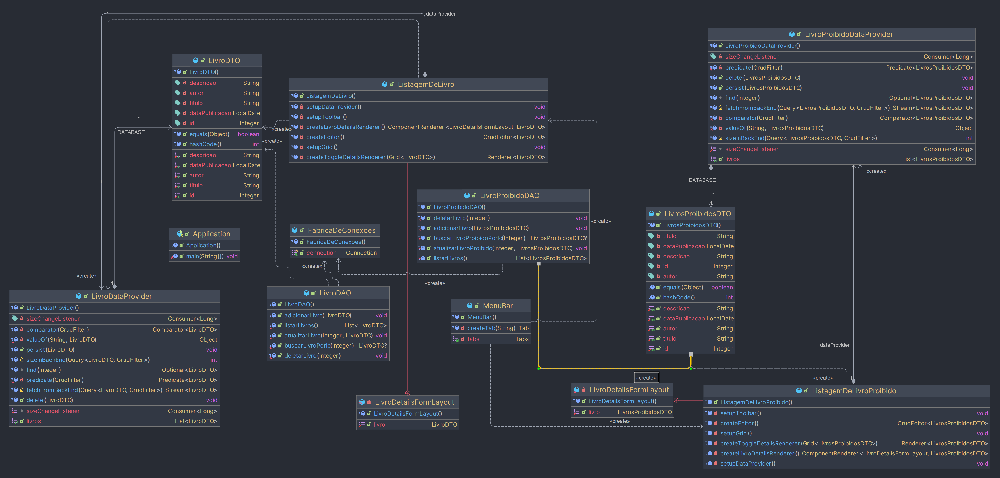

# Livraria


### Diagrama de classes


### Caso de Uso: Gerenciamento de Livros em Livraria

**Objetivo:** O funcionário da livraria pode gerenciar livros permitidos
**Cenário Principal:**

1. O funcionário da livraria acessa o sistema.
2. O funcionário navega até a seção de "Gerenciamento de Livros".
3. O funcionário pode escolher entre as seguintes opções:
- Adicionar livro permitido/proibido.
- Editar informações de um livro permitido/proibido.
- Excluir um livro permitido/proibido.
- Listar todos os livros permitidos/proibidos.
- Encontrar livro permitido/proibido por ID.

## Informações

*Banco de dados* : MySQL;
<br>
*JDBC* : Mysql Connector 8.0.33;
<br>
*JAVA* : OpenJDK 20;

## Query para rodar no banco de dados

### Importante rodar antes de executar o programa!

```sql

CREATE DATABASE IF NOT EXISTS biblioteca;
USE biblioteca;

-- Cria tabela
CREATE TABLE IF NOT EXISTS livros (
    id INT AUTO_INCREMENT PRIMARY KEY,
    titulo VARCHAR(255) NOT NULL,
    autor VARCHAR(255) NOT NULL,
    descricao TEXT
);

ALTER TABLE livros
ADD dataPublicacao DATE;

-- insere registros

INSERT INTO livros (titulo, autor, descricao) VALUES
    ('Dom Quixote', 'Miguel de Cervantes', 'Dom Quixote é uma obra do escritor espanhol Miguel de Cervantes. É considerada uma das maiores obras da literatura universal.'),
    ('Romeu e Julieta', 'William Shakespeare', 'Romeu e Julieta é uma tragédia escrita por William Shakespeare. Conta a história de dois jovens amantes de famílias inimigas em Verona.'),
    ('1984', 'George Orwell', '1984 é um romance distópico escrito por George Orwell. A obra é um clássico da literatura sobre totalitarismo.'),
    ('O Pequeno Príncipe', 'Antoine de Saint-Exupéry', 'O Pequeno Príncipe é uma história escrita por Antoine de Saint-Exupéry. É um conto filosófico sobre um príncipe que viaja por diferentes planetas.'),
    ('Harry Potter e a Pedra Filosofal', 'J.K. Rowling', 'Harry Potter e a Pedra Filosofal é o primeiro livro da série Harry Potter, escrito por J.K. Rowling.'),
    ('Cem Anos de Solidão', 'Gabriel García Márquez', 'Cem Anos de Solidão é um romance do escritor colombiano Gabriel García Márquez. É considerada uma obra-prima do realismo mágico.'),
    ('Orgulho e Preconceito', 'Jane Austen', 'Orgulho e Preconceito é um romance de Jane Austen. É uma comédia de costumes que aborda temas como casamento e preconceito social.'),
    ('O Senhor dos Anéis', 'J.R.R. Tolkien', 'O Senhor dos Anéis é uma trilogia de fantasia escrita por J.R.R. Tolkien. É ambientada em um mundo de fantasia chamado Terra-média.'),
    ('A Revolução dos Bichos', 'George Orwell', 'A Revolução dos Bichos é uma novela satírica escrita por George Orwell. Ela faz uma crítica à corrupção do poder e ao totalitarismo.'),
    ('Crime e Castigo', 'Fiódor Dostoiévski', 'Crime e Castigo é um romance de Fiódor Dostoiévski. Conta a história de Raskólnikov, um estudante que comete um assassinato e lida com a culpa.');

UPDATE livros SET dataPublicacao = '2023-09-30' WHERE id = 1;
UPDATE livros SET dataPublicacao = '2023-09-25' WHERE id = 2;
UPDATE livros SET dataPublicacao = '2023-08-15' WHERE id = 3;
UPDATE livros SET dataPublicacao = '2023-07-20' WHERE id = 4;
UPDATE livros SET dataPublicacao = '2023-09-05' WHERE id = 5;
UPDATE livros SET dataPublicacao = '2023-06-10' WHERE id = 6;
UPDATE livros SET dataPublicacao = '2023-04-30' WHERE id = 7;
UPDATE livros SET dataPublicacao = '2023-03-18' WHERE id = 8;
UPDATE livros SET dataPublicacao = '2023-02-05' WHERE id = 9;
UPDATE livros SET dataPublicacao = '2023-01-15' WHERE id = 10;

select * from livros


-- Criar a tabela livros_proibidos
CREATE TABLE IF NOT EXISTS livros_proibidos (
    id INT AUTO_INCREMENT PRIMARY KEY,
    titulo VARCHAR(255) NOT NULL,
    autor VARCHAR(255) NOT NULL,
    descricao TEXT,
    dataPublicacao DATE
);

-- Inserir registros de livros proibidos
INSERT INTO livros_proibidos (titulo, autor, descricao, dataPublicacao) VALUES
    ('O Livro da Maldição', 'Autor Desconhecido', 'Este livro é conhecido por trazer má sorte e desgraça a quem o lê.', '2020-01-01'),
    ('A Magia Negra', 'Feiticeiro Sombrio', 'Um guia para práticas de magia negra e rituais obscuros.', '2019-03-15'),
    ('O Livro dos Segredos Profundos', 'Anônimo', 'Contém informações perigosas sobre conspirações globais.', '2018-06-20'),
    ('A Arte da Manipulação', 'Maquiavel', 'Um manual para manipular e controlar pessoas.', '2017-11-10'),
    ('A Peste da Destruição', 'Autor Desconhecido', 'Escrito em uma língua desconhecida, a leitura deste livro pode causar doenças.', '2016-04-05'),
    ('O Livro Amaldiçoado', 'Bruxa Sombria', 'Diz-se que aqueles que o possuem experimentam eventos terríveis.', '2015-08-12'),
    ('O Livro da Ressurreição', 'Necromante', 'Contém rituais para invocar os mortos.', '2014-10-30'),
    ('O Manual do Caos', 'Caçador de Demônios', 'Um guia para invocar entidades demoníacas.', '2013-07-22'),
    ('O Livro das Trevas', 'Sacerdote das Sombras', 'Conhecido por causar pesadelos terríveis e eventos paranormais.', '2012-02-18'),
    ('O Tomo da Perdição', 'Feiticeiro Amaldiçoado', 'Este livro é considerado a fonte de infortúnio supremo.', '2011-12-03');

```

### O que fui utilizado?

Foi utilizado tudo que o professor Leanderson ensinou em sala de aula
em relação ao JDBC e as demais coisas.
E para manipular e integrar o front-end com o back-end foi utilizado o Vaadin Version 24.